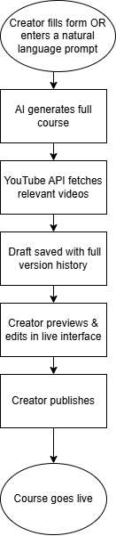

# 🎓 AI Education Platform

> A full-stack AI-powered course creation and learning platform built with Django — where educators generate complete courses using AI, and students enroll, learn, and get assessed with AI-graded exams.


---

## 📋 Table of Contents

- [Overview](#overview)
- [Key Features](#key-features)
- [How It Works](#how-it-works)
- [Tech Stack](#tech-stack)
- [Project Structure](#project-structure)
- [Data Models](#data-models)
- [Getting Started](#getting-started)
- [Configuration](#configuration)
- [API Reference](#api-reference)
- [Security](#security)
- [Deployment](#deployment)
- [Roadmap](#roadmap)

---

## Overview

The **AI Education Platform** is a Django-based web application that reimagines how online courses are created and consumed. Instead of manually writing course content, creators describe what they want — either through a structured form or a free-text prompt — and the AI generates a complete, structured course: chapter introductions, learning objectives, main content, practical examples, quizzes, and relevant YouTube videos, all in one pass.

Creators then review and edit the AI-generated content in a live preview interface before publishing. Once published, students can discover courses on the homepage, enroll, track their progress chapter by chapter, take AI-generated exams, and earn certificates.

**Live Demo:** *(coming soon)*
**GitHub:** [https://github.com/Sima922/AI_Education_Platform](https://github.com/Sima922/AI_Education_Platform)

---

## Key Features

### For Course Creators
- **Two creation modes** — generate a course from a natural language prompt, or fill a structured form with title, topic, and chapter titles
- **AI-generated course content** — Gemini 2.0 Flash generates introductions, learning objectives, main content, practical examples, and chapter summaries in a single batched API call per chapter
- **Auto-fetched YouTube videos** — relevant YouTube videos are automatically fetched and attached to each chapter based on AI-generated search queries
- **AI-generated quizzes** — multiple-choice quizzes with explanations are generated per chapter
- **Human-in-the-loop editing** — full preview and edit interface before publishing; creators can edit any section, reorder chapters, delete chapters, and swap videos
- **Draft versioning** — every edit auto-saves a versioned snapshot; creators can restore any previous version
- **AI-generated exams** — optional end-of-course exams generated by AI, with configurable time limits, passing scores, and attempt limits
- **File upload context** — creators can upload documents that the AI uses as source material when generating course content

### For Students
- **Course discovery** — homepage shows trending, new, and personalized recommended courses
- **Smart search** — multi-strategy search with exact match, keyword, partial word, and fuzzy matching with fallback to trending courses
- **Auto-enrollment** — free courses auto-enroll students on first visit
- **Granular progress tracking** — progress tracked per section (intro read, objectives read, content read, videos watched, quiz completed) with 80% threshold for chapter completion
- **Chapter quizzes** — interactive quizzes with scoring and answer explanations
- **Proctored exams** — end-of-course exams with tab-switch detection, fullscreen monitoring, and AI-assisted grading
- **Certificates** — AI-generated certificates of completion upon passing the exam
- **Course chatbot** — per-course AI chatbot powered by RAG (Retrieval-Augmented Generation) for answering student questions about course material

---

## How It Works

### Course Creation Flow



### Student Learning Flow


---

## Tech Stack

| Layer | Technology |
|---|---|
| Backend | Python 3.10+, Django 5.1 |
| AI — Content Generation | Google Gemini 2.0 Flash |
| AI — Course Q&A Chatbot | Custom RAG Service |
| REST API | Django REST Framework |
| Authentication | django-allauth (email + Google OAuth2) |
| Database | SQLite (dev) / PostgreSQL (prod) |
| Video Integration | YouTube Data API v3 |
| Media Storage | Local filesystem (AWS S3 planned) |
| Caching | Django LocMemCache (24hr response cache) |
| Frontend | HTML5, CSS3, JavaScript |
| Server Timezone | Africa/Gaborone (UTC+2) |

---

## Project Structure

```
AI_Education_Platform/
│
├── CoursePlatform/                  # Django project configuration
│   ├── settings.py                  # Settings (DB, auth, cache, logging)
│   ├── urls.py                      # Root URL configuration
│   └── wsgi.py / asgi.py
│
├── courses/                         # Main application
│   ├── models.py                    # All data models
│   │
│   ├── course_management.py         # Course creation, preview, draft, publish
│   ├── views.py                     # Enrollment, search, progress, REST views
│   ├── exam_views.py                # Exam config, sessions, grading, certificates
│   ├── quiz_management.py           # Chapter quiz submit/reset
│   ├── video_management.py          # Video upload and YouTube management
│   ├── chatbot_views.py             # Per-course AI chatbot
│   └── auth_views.py                # Signup, login, logout, profile
│   │
│   ├── ai_integration/              # All AI logic
│   │   ├── ai_module.py             # Main AI functions (entry point)
│   │   ├── gemini_integration.py    # Gemini API client, quota mgmt, caching
│   │   ├── youtube_fetcher.py       # YouTube Data API integration
│   │   ├── preprocessing.py         # File parsing and keyword extraction
│   │   └── rag_service.py           # RAG pipeline for course chatbot
│   │
│   ├── utils.py                     # Trending, new, personalized recommendations
│   ├── serializers.py               # DRF serializers
│   ├── forms.py                     # Django forms
│   ├── adapters.py                  # Custom allauth account/social adapters
│   └── urls.py                      # All app-level URLs
│
├── media/                           # User uploads (gitignored)
├── static/                          # Static assets (CSS, JS)
├── manage.py
├── db.sqlite3                       # Dev database (gitignored)
├── requirements.txt
└── .env                             # Secrets — never commit this
```

---

## Data Models

### Core Models

**`User`** — extends Django's `AbstractUser`
- `is_creator` — flag distinguishing creators from regular students
- Google OAuth2 social login support via django-allauth

**`Course`**
- `title`, `description`, `price` (default `0.00` — free)
- `thumbnail`, `creator` (FK → User)
- `file_context` — document text used during AI generation
- `keywords` — JSON list of keywords extracted from uploaded files

**`Topic`** — subject grouping within a course (title + description)

**`Chapter`** — the core learning unit; all fields are AI-generated
- `introduction`, `summary` (text)
- `main_content`, `learning_objectives`, `practical_examples` (JSON)
- `quiz` — JSON structure: `{"questions": [{"id", "question", "options", "correct_answer", "explanation"}]}`
- `order` — controls display sequence

**`VideoMetadata`** — video resource attached to a chapter
- `video_type`: `youtube` or `upload`
- Smart `youtube_id` and `embed_url` properties for safe iframe rendering
- `relevance_point` — the specific chapter concept this video covers

### Draft & Versioning

**`CourseDraft`** — the creator's working copy before publishing
- `content` (JSON) — full AI-generated course data
- `form_data` (JSON) — original form inputs
- `exam_config` (JSON) — optional exam configuration
- Auto-deleted after successful publish

**`CourseVersion`** — immutable snapshot of a draft
- `version_type`: `draft`, `auto-save`, or `published`
- Full restore capability from any snapshot

### Enrollment & Progress

**`Enrollment`** — user ↔ course relationship
- `exam_eligible`, `certificate_earned`, `certificate_url`

**`UserProgress`** — per-user, per-chapter progress record
- `intro_read`, `objectives_read`, `content_read` (booleans)
- `videos_watched` (JSON list of video IDs)
- `quiz_completed`, `quiz_score`
- `chapter_completed` — auto-set when `calculate_completion_percentage() >= 80`

### Exam System

**`CourseExam`** — one-to-one exam config per course
- `exam_type`: `default`, `custom` (AI prompt), or `template` (uploaded file)
- `time_limit_minutes`, `passing_score`, `max_attempts`
- `structure` (JSON) — full AI-generated exam with all questions

**`ExamQuestion`** — supports `multiple_choice`, `true_false`, `short_answer`, `essay`, `practical`

**`ExamSession`** — one student attempt
- `status`: `pending` → `in_progress` → `submitted` → `passed` / `failed` / `flagged`
- `tab_switch_count`, `fullscreen_exit_count` — proctoring metrics

**`ExamAnswer`**, **`ExamResult`**, **`ProctorLog`** — grading and proctoring audit records

### Chatbot

**`ChatbotConversation`** + **`ChatMessage`** — per-course conversation history powering the RAG chatbot

---

## Getting Started

### Prerequisites
- Python 3.10+
- pip + virtualenv
- Google Gemini API key ([get one here](https://aistudio.google.com/app/apikey))
- YouTube Data API v3 key ([get one here](https://console.cloud.google.com))
- *(Optional)* Google OAuth2 credentials for social login

### Installation

**1. Clone the repository**
```bash
git clone https://github.com/Sima922/AI_Education_Platform.git
cd AI_Education_Platform
```

**2. Create and activate a virtual environment**
```bash
python -m venv venv
source venv/bin/activate        # macOS/Linux
venv\Scripts\activate           # Windows
```

**3. Install dependencies**
```bash
pip install -r requirements.txt
```

**4. Configure environment variables**
```bash
cp .env.example .env
# Open .env and fill in your API keys
```

**5. Apply database migrations**
```bash
python manage.py migrate
```

**6. Create a superuser**
```bash
python manage.py createsuperuser
```

**7. Start the development server**
```bash
python manage.py runserver
```

- App: `http://127.0.0.1:8000`
- Admin: `http://127.0.0.1:8000/admin`

---

## Configuration

`.env` file reference:

```env
# Django Core
SECRET_KEY=generate-a-new-secret-key-here
DEBUG=True
ALLOWED_HOSTS=localhost,127.0.0.1

# AI Content Generation (required)
GEMINI_API_KEY=your-gemini-api-key

# YouTube Video Fetching (required)
GOOGLE_API_KEY=your-youtube-data-api-key

# Google OAuth2 Social Login (optional)
GOOGLE_CLIENT_ID=your-google-oauth-client-id
GOOGLE_CLIENT_SECRET=your-google-oauth-client-secret

# Production Database (leave blank to use SQLite locally)
DATABASE_URL=
```

Generate a new Django secret key:
```bash
python -c "from django.core.management.utils import get_random_secret_key; print(get_random_secret_key())"
```

---

## API Reference

### Pages & Course Management

| Method | URL | Description |
|---|---|---|
| GET | `/` | Homepage — trending, new, personalized courses |
| GET/POST | `/create-with-prompt/` | Prompt-based course creation |
| GET/POST | `/preview/<draft_id>/` | Preview and edit a course draft |
| POST | `/courses/create/` | Publish a draft as a live course |
| GET | `/view_course/<pk>/` | View course (auto-enrolls free courses) |
| GET | `/courses/` | List all courses (DRF JSON) |

### Draft Management

| Method | URL | Description |
|---|---|---|
| POST | `/drafts/<draft_id>/save-version/` | Save a new named version |
| POST | `/versions/<version_id>/restore/` | Restore a previous version |
| POST | `/drafts/<draft_id>/update-content/` | Update a specific section |
| POST | `/drafts/<draft_id>/reorder-chapters/` | Reorder chapters |
| POST | `/drafts/<draft_id>/delete-chapter/` | Delete a chapter |

### Progress & Enrollment

| Method | URL | Description |
|---|---|---|
| POST | `/courses/<course_id>/enroll/` | Enroll in a course |
| POST | `/courses/track-section/` | Mark a section as read |
| POST | `/courses/track-video/` | Mark a video as watched |
| GET | `/courses/progress/<course_id>/` | Get overall course progress % |

### Exam & Certification

| Method | URL | Description |
|---|---|---|
| GET/POST | `/courses/<course_id>/configure-exam/` | Set up exam |
| GET | `/courses/<course_id>/exam-eligibility/` | Check eligibility |
| POST | `/courses/<course_id>/start-exam/` | Begin an exam session |
| GET | `/exams/<session_id>/interface/` | Timed exam UI |
| POST | `/exams/<session_id>/submit/` | Submit answers |
| GET | `/exams/<session_id>/results/` | View AI-graded results |
| GET | `/courses/<course_id>/certificate/` | View/download certificate |

### Search & Discovery

| Method | URL | Description |
|---|---|---|
| GET | `/courses/smart-search/?q=<query>` | Smart multi-strategy search |
| GET | `/api/recommendations/?type=trending` | Recommendations API (`trending`, `new`, `recommended`) |

---

## Security

### 🔴 Fix Before Going to Production

**1. Replace the hardcoded `SECRET_KEY` in `settings.py`:**
```python
SECRET_KEY = os.environ.get('SECRET_KEY')
```

**2. Set `DEBUG = False`:**
```python
DEBUG = os.environ.get('DEBUG', 'False') == 'True'
```

**3. Configure `ALLOWED_HOSTS`:**
```python
ALLOWED_HOSTS = os.environ.get('ALLOWED_HOSTS', '').split(',')
```

**4. Remove `db.sqlite3` from git:**
```bash
git rm --cached db.sqlite3
echo "db.sqlite3" >> .gitignore
git commit -m "security: remove db from tracking"
```

**5. Add production security headers:**
```python
SECURE_BROWSER_XSS_FILTER = True
SECURE_CONTENT_TYPE_NOSNIFF = True
X_FRAME_OPTIONS = 'DENY'
SECURE_HSTS_SECONDS = 31536000
SESSION_COOKIE_SECURE = True
CSRF_COOKIE_SECURE = True
SECURE_SSL_REDIRECT = True
```

**6. Switch to PostgreSQL:**
```bash
pip install psycopg2-binary dj-database-url
```
```python
import dj_database_url
DATABASES = {'default': dj_database_url.config(default=os.environ.get('DATABASE_URL'))}
```

### ✅ Already in Place
- CSRF protection via Django middleware
- `@login_required` on all protected views
- `PermissionDenied` raised when accessing another creator's draft
- `GEMINI_API_KEY` loaded from environment variable only
- `transaction.atomic()` on enrollment and course publish to prevent partial saves
- Gemini API responses cached for 24 hours to prevent quota exhaustion
- Exponential backoff on Gemini API quota errors

---

## Deployment

### Railway (Recommended — Free Tier Available)

1. Push to GitHub, connect repo at [railway.app](https://railway.app)
2. Add a PostgreSQL plugin from the Railway dashboard
3. Set all environment variables in Railway settings
4. Add a `Procfile` to the repo root:
```
web: gunicorn CoursePlatform.wsgi
```
5. Install production packages and update requirements:
```bash
pip install gunicorn whitenoise psycopg2-binary dj-database-url
pip freeze > requirements.txt
```
6. Configure static files in `settings.py`:
```python
MIDDLEWARE = ['whitenoise.middleware.WhiteNoiseMiddleware', ...]
STATIC_ROOT = BASE_DIR / 'staticfiles'
STATICFILES_STORAGE = 'whitenoise.storage.CompressedManifestStaticFilesStorage'
```
7. Run `python manage.py collectstatic`, commit, and push to deploy.

---

## Roadmap

### Immediate
- [ ] Move `SECRET_KEY` to `.env`
- [ ] Remove `db.sqlite3` from git history
- [ ] Deploy to Railway and add live demo link to README
- [ ] Add `requirements.txt` with pinned versions

### Short Term
- [ ] Complete Stripe payment integration for paid courses
- [ ] Full certificate PDF generation and download
- [ ] Email notifications (enrollment, exam results, certificate)
- [ ] Creator analytics dashboard (enrollments, quiz scores, completion rates)
- [ ] Unit and integration tests with `pytest-django`

### Long Term
- [ ] Migrate media storage to AWS S3 or Cloudinary
- [ ] Adaptive learning paths based on quiz performance
- [ ] Docker + docker-compose containerization
- [ ] GitHub Actions CI/CD pipeline
- [ ] Mobile app (React Native or Flutter)

---

## Contributing

1. Fork the repository
2. Create a feature branch: `git checkout -b feature/your-feature`
3. Commit your changes: `git commit -m 'feat: describe your change'`
4. Push: `git push origin feature/your-feature`
5. Open a Pull Request

Please follow [Conventional Commits](https://www.conventionalcommits.org/).

---

## License

MIT License — see [LICENSE](LICENSE) for details.

---

## Author

**Sima922** · [GitHub](https://github.com/Sima922)

*Built with Django 5.1, Google Gemini 2.0 Flash, and the YouTube Data API*
